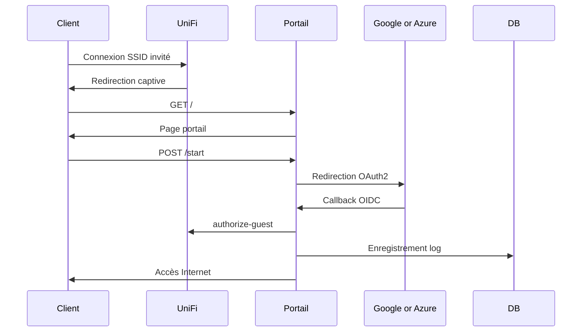

# Gab WiFi – Portail captif UniFi avec authentification Google ou Azure (OIDC)

Ce projet implémente un **portail captif WiFi auto‑hébergé** pour UniFi (Cloud Gateway Ultra / UniFi OS),
permettant l’authentification des invités via **OpenID Connect**, avec journalisation conforme RGPD
et interface d’administration protégée par mot de passe.

---

## 🎯 Objectifs
- Authentifier les invités WiFi via un compte Google ou Azure
- Autoriser automatiquement les clients via l’API UniFi
- Journaliser les connexions (audit / RGPD)
- Hébergement local, déploiement Docker
- Administration simple via une page protégée

---

## 🧱 Architecture globale

```mermaid
flowchart LR
    Client["Client WiFi"]
    AP["UniFi AP"]
    Portal["Portail Captif (Node.js)"]
    Google["Google OIDC"]
    UniFi["UniFi Gateway / Controller"]
    DB["PostgreSQL"]
    Nginx["Nginx HTTPS"]

    Client --> AP --> Portal
    Portal --> Google or Azure
    Azure ir Google --> Portal
    Portal --> UniFi
    Portal --> DB
    Nginx --> Portal
```

---

## 🔁 Diagramme de séquence



---

## 📁 Structure du projet

```
gab-wifi/
├── portal/
│   ├── src/
│   │   ├── app.js        # Application principale
│   │   ├── oidc.js       # Authentification Google
│   │   ├── unifi.js      # API UniFi (authorize-guest)
│   │   ├── db.js         # Base PostgreSQL
│   │   └── views/        # Pages HTML
│   ├── Dockerfile
│   └── package.json
├── nginx/
│   └── conf.d/
│       └── portal.conf
├── docker-compose.yml
├── .env.example
└── README.md
```

---

## 🔐 Page d’administration
- URL : `/admin`
- Protection : **Basic Auth (Node.js)**
- Données visibles :
  - date
  - email Google
  - MAC client
  - SSID
  - IP
  - résultat (SUCCESS / FAIL)

---

## ⚙️ Configuration UniFi requise

### SSID
- Sécurité : Open
- Activer **Guest Policy**
- Redirection externe vers :
  `https://gab-wifi.duckdns.org/`

### Walled Garden
Autoriser pour gmail :
- `accounts.google.com`
- `oauth2.googleapis.com`
- `*.googleusercontent.com`
- domaine du portail

Autoriser pour Azure :
- login.microsoftonline.com
- *.msauth.net
- *.msftauth.net

### Compte UniFi
- Compte **local** (pas SSO)
- Rôle : Super Admin (pour test)
- Utilisé uniquement par le portail

---

## 🚀 Déploiement

### Cloner le dépôt
```bash
git clone https://github.com/<user>/gab-wifi.git
cd gab-wifi
```

### Démarrer
```bash
docker compose up -d --build
```

### Logs
```bash
docker logs -f wifi_portal
```

### Arrêt
```bash
docker compose down
```

---

## 📜 RGPD
- Consentement explicite
- Données minimales
- Durée de rétention configurable
- Hébergement local

---
## Première génération du certificat (one-shot)

👉 Important : le domaine doit déjà pointer vers ton serveur (DuckDNS OK).

### 1 Lance Nginx sans HTTPS actif (le fichier peut rester tel quel)

docker compose up -d nginx

### 2 Génère le certificat :

docker compose run --rm certbot certonly \
  --webroot \
  -w /var/www/certbot \
  -d gab-wifi.duckdns.org \
  --email toi@exemple.ch \
  --agree-tos \
  --no-eff-email


Si tout va bien :

Congratulations! Your certificate and chain have been saved at:


### 3 Redémarre tout :

docker compose down
docker compose up -d

## 🧑‍💻 Auteur
Projet pédagogique et professionnel – Portail captif UniFi moderne et extensible.
